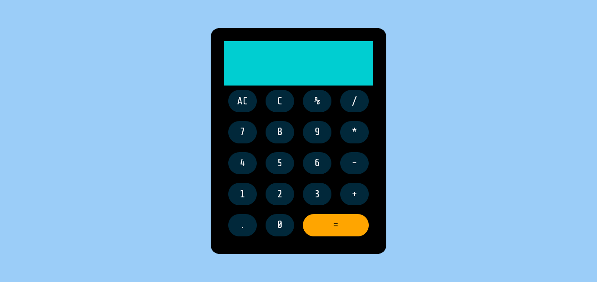
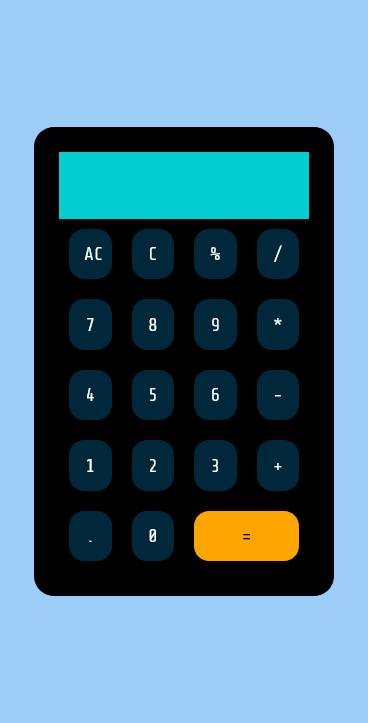

# Web Calculator App build by [atanasovCode](https://github.com/AtanasovCode)

## Table Of Contents 

-[Overview](#overview)
    -[The Challange](#the-challange)
    -[Screenshot](#screenshot)
    -[Built With](#built-with)
    -[Sources](#sources)
    -[IMPORTANT](#important)

## Overview

### The Challenge 

Build a working calculator app.
Users should be able to:
    - Do basic math calculations
    - String calculations together
    - Clear 
    - Delete

### Screenshot

### Built With 

- HTML
- CSS
- JavaScript

### Sources 

[Create a simple calculator using HTML, CSS, JavaScript](https://www.youtube.com/watch?v=QS6Y0ezhyCs)

- A very helpful resource!

### IMPORTANT

Do not use JavaScript eval() because it can be used to insert malicious code into your webpage.
It is only used here on this simple calculator app!

[Why you shouldn't use eval()](https://www.digitalocean.com/community/tutorials/js-eval)
